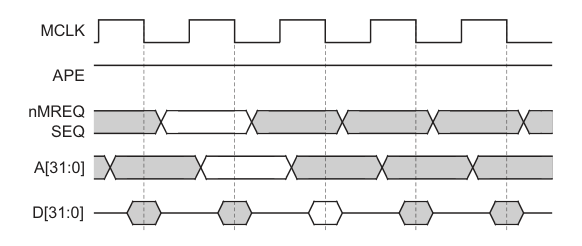
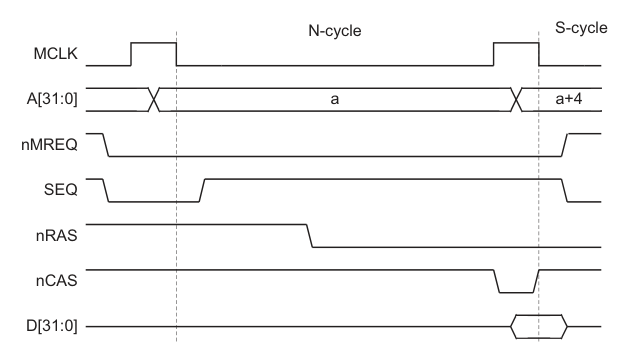
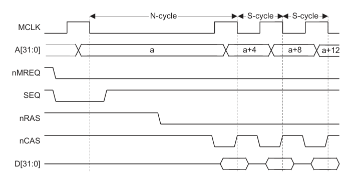
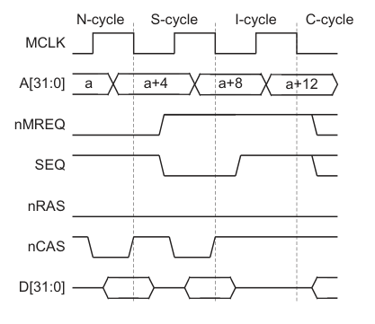

# SIGNALS

Clocking and clock control signals —

- `MCLK` — The main clock. Has two phases: a low phase and a high phase. Procedures can be constrained to any combination of these four: (1) the _start_ of the low phase, (2) the _interior_ of the low phase, (3) the _start_ of the high phase, and (4) the _interior_ of the high phase.

- `WAIT` — This signal is used to insert wait cycles. Different memory regions have different access latency, which determines how many wait cycles need to be inserted.

- `ECLK` — `MCLK` exported from the core, for debugging. Has a small latency. Irrelevant for the emulator.

- `RESET` — Used to start the processor. Must be held _high_ for at least 2 cycles, with `WAIT` set to _low_.

Address signals —

- `A` — The 32-bit address bus. The CPU writes an address to this but, for memory access requests.

- `RW` — This signal is used to distinguish between memory read and memory write. Set to _high_ for read requests, set to _low_ for write requests.

- `MAS` — Memory access size.

- `OPC` —  This signal is used to distinguish between next-instruction-fetch and data-read/data-write. Set to _high_ for instruction fetch request, set to _low_ for data read/write requests.

- `TRANS` — This signal is used to enable address translation in the memory management system. Irrelevant for the emulator.

- `LOCK` — Locks the memory, giving exclusive access to it to the CPU. This is effectively a mutex.

- `TBIT` — Set to _high_ for Thumb mode, set to _low_ for ARM mode.

Memory request signals —

- `MREQ` — Set to _high_ to indicate that the next cycle will be used to execute a memory request.

- `SEQ` — Set to _high_ to indicate that the address of the next memory request will be in the same word that was accessed in the previous memory access or the word immediately after it. Sequential reads require fewer memory cycles.

Data signals —

- `D` — The bidirectional tri-state data bus of the GBA.

- `DIN` — Unidirectional input data bus. Irrelevant for the emulator.

- `DOUT` — Unidirectional output data bus. Irrelevant for the emulator.

- `ABORT` — The memory sets this to _high_ to tell the CPU that the memory access request cannot be fulfilled.

- `BL` — Byte latch control. A 4-bit bus where each bit corresponds to one of the bytes in a word. Used to indicate which part of the requested word is to be read/written.

# TIMINGS

The timings are derived from the original timing diagrams from the `ARM DDI 0210C`, but they have been adjusted such that all transitions occur at tick boundaries, ie at the transitions of `MCLK`. Each cycle corresponds to 2 ticks of the emulator.

There are 3 reasons a line / bus might change:

1. In an immediate response to another signal changing (`force` by its callback function).

2. In a delayed response to itself or another signal changing (`put` by its callback function).

3. In an immediate or delayed response to some non-signal procedure happening within the tick (`force` or `put` by said procedure).

These are indicated in the timing diagrams in the following ways, respsectively:

1. Both signals transition at the same tick boundary, with no adjacent shaded regions, and an arrow from the transition in the effecting signal to the transition in the effected signals.

2. Both signals transition at different boundaries (the effecting signal preceding the effected signal), with no adjacent shaded regions, and an arrow from the transition in the effecting signal to the transition in the effected signal.

3. The region within the cycle where the transition is expected to be effected is shaded in. If the procedure that effected the transition depends on some preceding transition of another signal, an arrow is drawn from that transition to the shaded region.

An time interval is a half-open interval, composed of two parts: a _start_ and an _interior_. Read/write rules of the tick immediately after an interval are independent of the type of said interval and instead depend on the type of the succeeding interval. Every component has a `tick_phase_one` procedure and a `tick_phase_two` procedure.

Types of intervals in a timing diagram (source: ARM DDI 0210C xviii):

- _Open Unshaded_ - The line/bus is expected to remain stable throughout this interval.

  - _Writing_ occurs at the _start_ and is prohibited in the _interior_.

  - _Reading_ is allowed at the _start_ (by signals succeding it in the tick order) and in the _interior_.

- _Open Shaded_ - The line/bus is expected to change at an arbitrary time during this interval.

  - _Writing_ is prohibited at the _start_ and allowed in the _interior_.

  - Reading is allowed at the _start_ and prohibited in the _interior_.

- _Closed_ - The line/bus is disabled.

  - _Writing_ is prohibited at the _start_ and prohibited in the _interior_.

  - _Reading_ is prohibited at the _start_ and in the _interior_. 

## Simple Memory Cycle

The memory request control signals (`MREQ` and `SEQ`) are set during the _interior_ of phase 1 of cycle 1 and must remain stable until-and-including the _start_ of phase 1 of cycle 2. The address must be put on the address bus (`A`) during the _interior_ of phase 2 of cycle 1 and must remain stable until-and-including the _start_ of phase 2 of cycle 2. The data is put on the data bus (`D`) during phase 2 of cycle 2 and must remain stable until-and-including the _start_ of phase 1 of cycle 3.

Source: ARM DDI 0210C 3-4

 

## Nonsequential Memory Cycle

Interior logic implemented by: `Bus_Controller`

 

A memory request is initiated during phase 1 of cycle 1 by setting `MREQ` to _high_. In phase 2 of cycle 1 the address is put on the address bus. During phase 2 of cycle 2 the memory will put the data on the data bus. At the start of cycle 3 the data will be read from the data bus. The memory might extend phase 1 (literally delaying the rise) of cycle 2 to give itself enough time to fulfill the request, by using the `WAIT` signal. The type of the cycle is determined at the _start_ of phase 1.

- `MCLK` — The main clock, with an optionally extended phase 1.

- `A` — The address bus. Readable at the _start_ of phase 1 and 2 and during the _interior_ of phase 1.

- `MREQ` — The memory request signal. Set during phase 1 of the preceding cycle. Stable all throughout the memory cycle and at the _start_ of the next cycle.

- `SEQ — The sequential access signal. Set during phase 1 of the preceding cycle. Stable at the _start_ of the memory cycle.

- `RAS`, `CAS` — DRAM signals. Irrelevant for the emulator.

- `D` — The data bus. Readable at the _start_ of the cycle after the memory cycle.

Source: ARM DDI 0210C 3-6

## Sequential Memory Cycle 

Interior logic implemented by: `Bus_Controller`

Sequential transfer mode is for burst transfer, which is faster. Can access words of halfwords (but not bytes) sequentially, incrementing the address by 4 or 2, respectively. Must be preceded by a nonsequential cycle. `MREQ` remains _high_. `A` is incremented by 2 or 4 during the _interior_ of phase 2 of each cycle. The data is put on the data bus during phase 2 of each cycle and it is read at the _start_ of the next cycle. Only Thumb instructions perform halfword requests.

Source: ARM DDI 0210C 3-7

## Internal Cycle

Interior logic implemented by: `Bus_Controller`

Internal cycles don't involve any memory requests, but only transfers among registers.

## General Timings

The delay to `ECLK` is removed, but this is irrelevant. Signals `MREQ`, `SEQ`, `EXEC`, and `INSTRVALID` are expected to change at some point during phase 1, thus they must be stable at the _start_ of both phases and must be mutable in the _interior_ of phase 1. Signals `A`, RW`, `MAS`, `LOCK`, `M`, `TRANS`, `TBIT`, and `OPC` are expected to change at some point during phase 2, thus they must be stable at the _start_ of both phases and must be mutable in the _interior_ of phase 2. There are no dependencies here, only stability/mutability constraints for different parts of the cycle.

The lines `MREQ`, `SEQ`, `EXEC`, and `INSTRVALID` are allowed to be updated during the low phase of `MCLK`. There is no guarantee at which point within the tick that will happen. The lines `RW`, `LOCK`, `TRANS`, `TBIT`, `OPC`, and the buses `A`, `MAS`, and `M` are allowed to be updated during the high phase of `MCLK`. There is no guarantee at which point within the tick that will happen. During the _low_ phase of the cycle, the CPU determines whether the instruction is going to be executed (by setting `EXEC`) and whether a memory access will be required (by setting `MREQ`). Then during the _high_ phase of the cycle, the CPU sends the address to memory (by writing `A`), sends the size of the memory access to memory (by writing `MAS`), tells the memory whether it requires a read or a write (by setting `RW`), tells the memory whether it requires locked access (by setting `LOCK`), and tells the memory whether it wants to fetch the next instruction or perform a general memory access (by setting `OPC`). Instruction fetch requests and general memory access requests are served in separate cycles.

- `ECLK` - This is irrelevant (do not emulate debugging circuitry).

- `MREQ` - The processor sets this signal to _high_ to request memory access in the following cycle.

- `SEQ` - The processor sets this to _high_ to indicate that the next memory access will be of the same word or the word after the previously accessed word.

- `EXEC` - The processor sets this to _low_ when the instruction currently in the execution unit is not going to be executed, because it has failed its condition code or because it is undefined.

- `INSTRVALID` - The processor sets this to _high_ when the instruction currently in the execution unit is defined and succeeded its condition code and is going to be executed.

- `A` - The CPU writes addresses to this bus, and the memory reads them from it. Access to this bus depends on lines `ALE`, `ABE`, and `APE`.

- `RW` - The CPU sets this to _high_ when it's performing a read cycle and to _low_ when it's performing a write cycle. This line depends on lines `ALE`, `ABE`, and `APE`.

- `MAS` - The CPU writes here the size in bytes of the requested memory access (for both read and write cycles). This bus depends on lines `ALE`, `ABE`, and `APE`.

- `LOCK` - The CPU sets this to _high_ when it's performing a locked memory access (when it takes sole ownership of memory). This line depends on lines `ALE`, `ABE`, and `APE`.

- `M` - The CPU writes its processor mode on this bus.

- `TRANS` - This is irrelevant (no address translation on the GBA).

- `TBIT` - The CPU sets this to _high_ when it is in Thumb mode. Must change in the _high_ phase of the first execute cycle of the `BX` instruction.

- `OPC` - The CPU sets this to _high_ when it is fetching an instruction from memory. This line depends on lines `ALE`, `ABE`, and `APE`.

## ABE Address Control Timings

`ABE` is allowed to go low at the _start_ of phase 1 (_or in the interior of phase 2 of the previous cycle, maybe_). This must enable `A`, `RW`, `LOCK`, `OPC`, `TRANS`, and `MAS`. If `ABE` is _low_ at the _start_ of phase 2, it must go _high_. This must disable 

- `MCLK` - The main clock.

- `ABE` - Address bus enable line. The CPU sets this to _high_ (at the _start_ of the _low_ phase of the cycle) to enable the enabled the address bus (`A`) and its control lines / buses (`LOCK`, `MAS`, `RW`, `OPC`, and `TRANS`), ie to tell the memory that it will have to serve a request in the next cycle. `ABE` must be scheduled to return to _high_ after one tick.

- Address bus & control lines are disabled when the CPU sets `ABE` to _low_. Thus the `line_tick` of `ABE` must precede the `line_tick`/`bus_tick` of all of them.

## Bidirectional Data Write Cycle Timings

Bidirectional memory access is a single operation that performs a read and a write in adjacent cycles. This does not happen simultaneously, but in separate cycles. _Why is this bidirectional? How does the bidirectional write cycle differ from the unidirectional write cycle?_

- `MCLK` - The main clock.

- `ENOUT` - Enable output. At some point during the _high_ phase of the previous cycle, the CPU sets this to _high_ to enable (take ownership of) the data bus, taking ownership. There is only one device on the GBA competing with the CPU for access to the data bus: the DMA controller. The DMA controller has priority, so whenever it requests memory access, it sets `ENOUT` to _low_, disabling `D`, and taking ownership of the data bus. `ENOUT` is scheduled to return to _high_ after one cycle / two ticks. `ENOUT` must succeed `MCLK` in the tick order.

- `D` - The interface of the CPU to the data bus. This starts disabled and is enabled when `ENOUT` goes _high_ and then disabled again when `ENOUT` goes _low_. `D` must succeed `ENOUT` in the tick order.

## Bidirectional Data Read Cycle Timings

_Why is this bidirectional? How does the bidirectional read cycle differ from the unidirectional read cycle?_

- `MCLK` - The main clock.

- `ENOUT` - Enable output. During a read cycle, when `ENOUT` is set to _high_, the CPU has to write to the `BL` bus the size of the requested data within one tick, and then at the _start_ of the next tick, the memory will parse the request and put the data `D` immediately.

- `D` - The interface of the CPU to the data bus. Enabling this is delayed by 1 tick relative to the write cycle, because the memory has to receive and complete the request before it can send the data to the CPU.

- `BL` - Byte latch control. Selects what combination of byte from the word are to be read/written.

## Data Bus Control Timings

This is a write cycle.

- `MCLK` - The main clock.

- `ENOUT` - Enable output. The CPU sets this to _high_ at the _start_ of phase 1 to indicate a write cycle.

- `DBE` - Data bus enable. The CPU sets this to _high_ to enable the data bus, during read/write cycles. _What happens if the bus is currently owned by the DMA controller?_

- `D` - Data bus.

## Output 3-State Timings

## Unidirectional Data Write Cycle Timings

## Unidirectional Data Read Cycle Timings

## Configuration Pin Timings

## Exception Timings

## Synchronous Interrupt Timings

## Main Clock Timings

## Reset Period Timings

## ALE Address Control Timings

## APE Address Control Timings

