# TIMINGS

There are 3 reasons a line / bus might change:

1. In an immediate response to another signal changing (`force` by its callback function).

2. In a delayed response to itself or another signal changing (`put` by its callback function).

3. In an immediate or delayed response to some non-signal procedure happening within the tick (`force` or `put` by said procedure).

These are indicated in the timing diagrams in the following ways, respsectively:

1. Both signals transition at the same tick boundary, with no adjacent shaded regions, and an arrow from the transition in the effecting signal to the transition in the effected signals.

2. Both signals transition at different boundaries (the effecting signal preceding the effected signal), with no adjacent shaded regions, and an arrow from the transition in the effecting signal to the transition in the effected signal.

3. The region within the cycle where the transition is expected to be effected is shaded in. If the procedure that effected the transition depends on some preceding transition of another signal, an arrow is drawn from that transition to the shaded region.

## General Timings

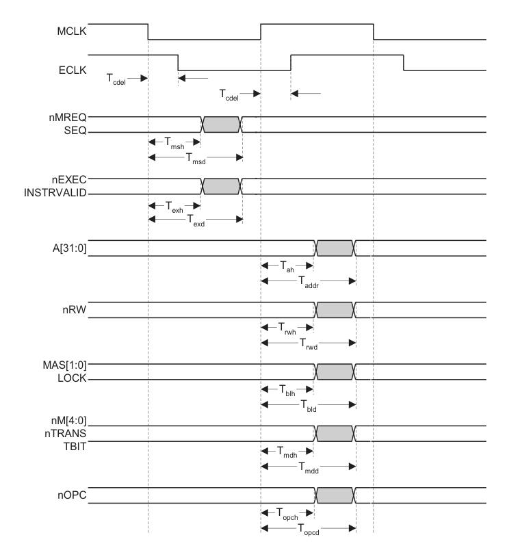

The delay to `ECLK` is removed, but this is irrelevant. Signals `MREQ`, `SEQ`, `EXEC`, and `INSTRVALID` are expected to change at some point during phase 1, thus they must be stable at the _start_ of both phases and must be mutable in the _interior_ of phase 1. Signals `A`, `RW`, `MAS`, `LOCK`, `M`, `TRANS`, `TBIT`, and `OPC` are expected to change at some point during phase 2, thus they must be stable at the _start_ of both phases and must be mutable in the _interior_ of phase 2. There are no dependencies here, only stability/mutability constraints for different parts of the cycle.

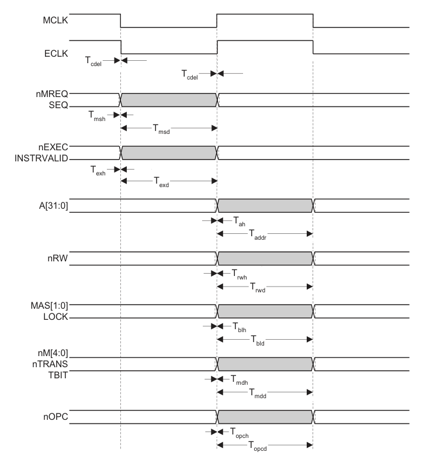

The lines `MREQ`, `SEQ`, `EXEC`, and `INSTRVALID` are allowed to be updated during the low phase of `MCLK`. There is no guarantee at which point within the tick that will happen. The lines `RW`, `LOCK`, `TRANS`, `TBIT`, `OPC`, and the buses `A`, `MAS`, and `M` are allowed to be updated during the high phase of `MCLK`. There is no guarantee at which point within the tick that will happen. During the _low_ phase of the cycle, the CPU determines whether the instruction is going to be executed (by setting `EXEC`) and whether a memory access will be required (by setting `MREQ`). Then during the _high_ phase of the cycle, the CPU sends the address to memory (by writing `A`), sends the size of the memory access to memory (by writing `MAS`), tells the memory whether it requires a read or a write (by setting `RW`), tells the memory whether it requires locked access (by setting `LOCK`), and tells the memory whether it wants to fetch the next instruction or perform a general memory access (by setting `OPC`). Instruction fetch requests and general memory access requests are served in separate cycles.

- `ECLK` - This is irrelevant (do not emulate debugging circuitry).

- `MREQ` - The processor sets this signal to _high_ to request memory access in the following cycle.

- `SEQ` - The processor sets this to _high_ to indicate that the next memory access will be of the same word or the word after the previously accessed word.

- `EXEC` - The processor sets this to _low_ when the instruction currently in the execution unit is not going to be executed, because it has failed its condition code or because it is undefined.

- `INSTRVALID` - The processor sets this to _high_ when the instruction currently in the execution unit is defined and succeeded its condition code and is going to be executed.

- `A` - The CPU writes addresses to this bus, and the memory reads them from it. Access to this bus depends on lines `ALE`, `ABE`, and `APE`.

- `RW` - The CPU sets this to _high_ when it's performing a read cycle and to _low_ when it's performing a write cycle. This line depends on lines `ALE`, `ABE`, and `APE`.

- `MAS` - The CPU writes here the size in bytes of the requested memory access (for both read and write cycles). This bus depends on lines `ALE`, `ABE`, and `APE`.

- `LOCK` - The CPU sets this to _high_ when it's performing a locked memory access (when it takes sole ownership of memory). This line depends on lines `ALE`, `ABE`, and `APE`.

- `M` - The CPU writes its processor mode on this bus.

- `TRANS` - This is irrelevant (no address translation on the GBA).

- `TBIT` - The CPU sets this to _high_ when it is in Thumb mode. Must change in the _high_ phase of the first execute cycle of the `BX` instruction.

- `OPC` - The CPU sets this to _high_ when it is fetching an instruction from memory. This line depends on lines `ALE`, `ABE`, and `APE`.

## ABE Address Control Timings

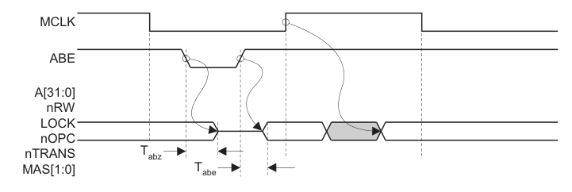

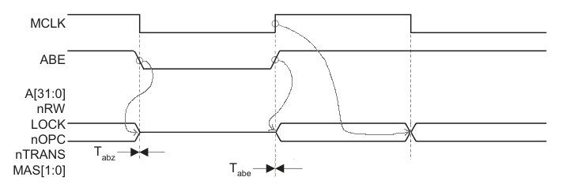

`ABE` is allowed to go low at the _start_ of phase 1 (_or in the interior of phase 2 of the previous cycle, maybe_). This must enable `A`, `RW`, `LOCK`, `OPC`, `TRANS`, and `MAS`. If `ABE` is _low_ at the _start_ of phase 2, it must go _high_. This must disable

- `MCLK` - The main clock.

- `ABE` - Address bus enable line. The CPU sets this to _high_ (at the _start_ of the _low_ phase of the cycle) to enable the enabled the address bus (`A`) and its control lines / buses (`LOCK`, `MAS`, `RW`, `OPC`, and `TRANS`), ie to tell the memory that it will have to serve a request in the next cycle. `ABE` must be scheduled to return to _high_ after one tick.

- Address bus & control lines are disabled when the CPU sets `ABE` to _low_. Thus the `line_tick` of `ABE` must precede the `line_tick`/`bus_tick` of all of them.

## Bidirectional Data Write Cycle Timings

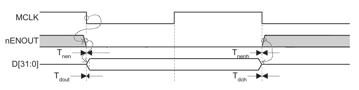

Bidirectional memory access is a single operation that performs a read and a write in adjacent cycles. This does not happen simultaneously, but in separate cycles. _Why is this bidirectional? How does the bidirectional write cycle differ from the unidirectional write cycle?_

- `MCLK` - The main clock.

- `ENOUT` - Enable output. At some point during the _high_ phase of the previous cycle, the CPU sets this to _high_ to enable (take ownership of) the data bus, taking ownership. There is only one device on the GBA competing with the CPU for access to the data bus: the DMA controller. The DMA controller has priority, so whenever it requests memory access, it sets `ENOUT` to _low_, disabling `D`, and taking ownership of the data bus. `ENOUT` is scheduled to return to _high_ after one cycle / two ticks. `ENOUT` must succeed `MCLK` in the tick order.

- `D` - The interface of the CPU to the data bus. This starts disabled and is enabled when `ENOUT` goes _high_ and then disabled again when `ENOUT` goes _low_. `D` must succeed `ENOUT` in the tick order.

## Bidirectional Data Read Cycle Timings

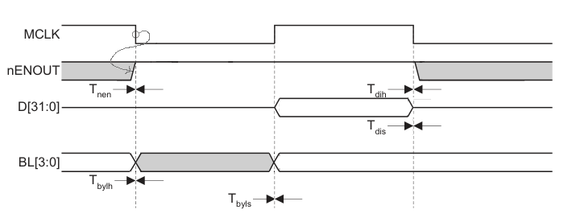

_Why is this bidirectional? How does the bidirectional read cycle differ from the unidirectional read cycle?_

- `MCLK` - The main clock.

- `ENOUT` - Enable output. During a read cycle, when `ENOUT` is set to _high_, the CPU has to write to the `BL` bus the size of the requested data within one tick, and then at the _start_ of the next tick, the memory will parse the request and put the data `D` immediately.

- `D` - The interface of the CPU to the data bus. Enabling this is delayed by 1 tick relative to the write cycle, because the memory has to receive and complete the request before it can send the data to the CPU.

- `BL` - Byte latch control. Selects what combination of byte from the word are to be read/written.

## Data Bus Control Timings

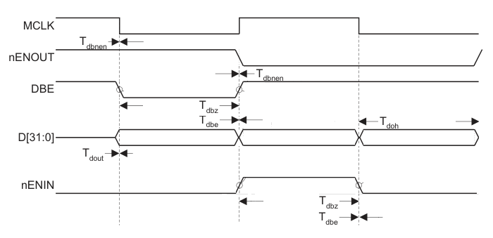

This is a write cycle.

- `MCLK` - The main clock.

- `ENOUT` - Enable output. The CPU sets this to _high_ at the _start_ of phase 1 to indicate a write cycle.

- `DBE` - Data bus enable. The CPU sets this to _high_ to enable the data bus, during read/write cycles. _What happens if the bus is currently owned by the DMA controller?_

- `D` - Data bus.

## Output 3-State Timings

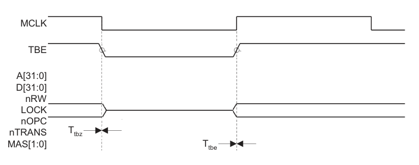

## Unidirectional Data Write Cycle Timings

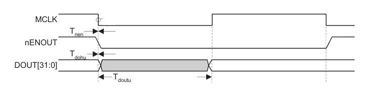

## Unidirectional Data Read Cycle Timings

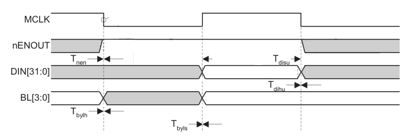

## Configuration Pin Timings

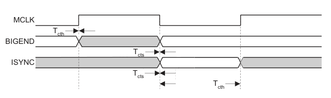

## Exception Timings

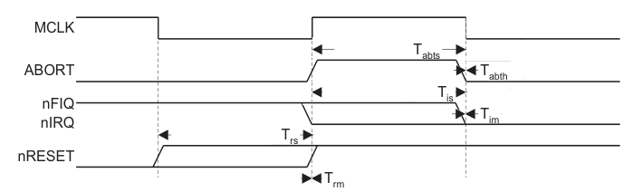

## Synchronous Interrupt Timings

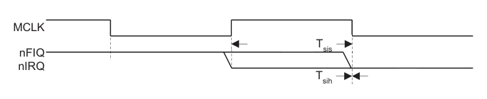

## Main Clock Timings

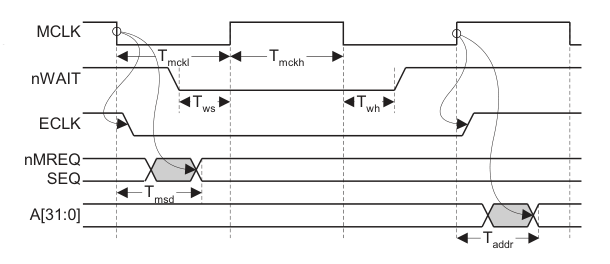

## Reset Period Timings

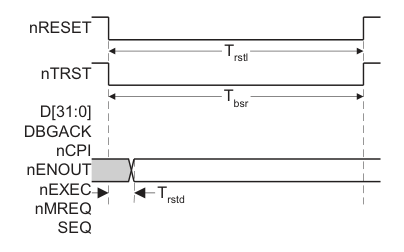

## ALE Address Control Timings

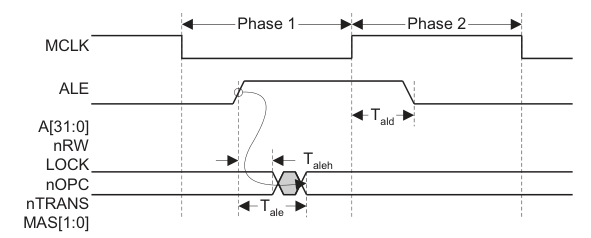

## APE Address Control Timings

